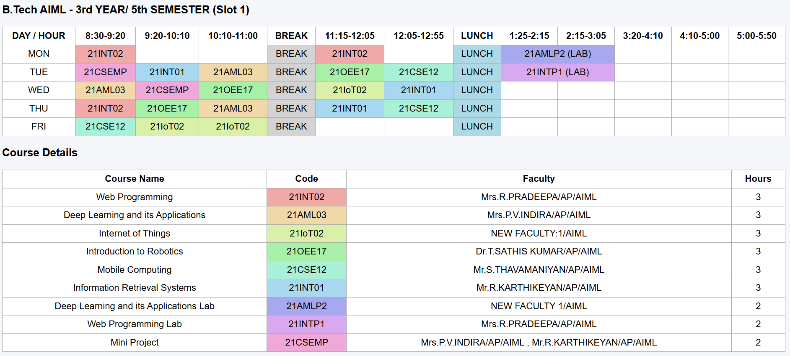

# 🤖 AI-Based Automated Timetable Generation System with Constraint Optimization

## Overview
This project uses Artificial Intelligence and Constraint Optimization techniques to automatically generate academic timetables. It creates conflict-free schedules by considering faculty availability, classroom allocation, subject distribution, and time-slot constraints.

## Features
- Automatic timetable generation
- Constraint-based scheduling
- Faculty and classroom allocation
- Conflict-free timetable creation
- Efficient resource utilization

## Technologies Used
- Python
- Artificial Intelligence
- Constraint Optimization
- Google OR-Tools
- Visual Studio Code

## Skills
- Artificial Intelligence
- Constraint Optimization
- Python Programming
- Optimization Algorithms
- Scheduling
- Problem Solving

## Output Preview

## Project Files
- Source Code
- README.md

## Author
Hemshree Bhagavathi S
